# Base Mermaid Colorset Fixture

This fixture intentionally keeps one minimal Mermaid block per declaration. It is used as the base diagram set for colorset insertion tests.

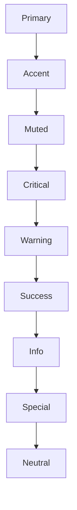

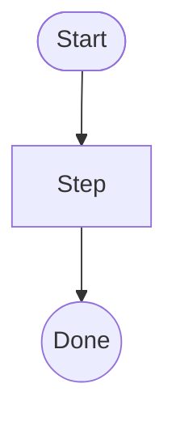

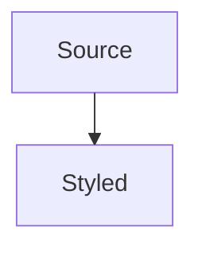

```mermaid
swimlane-beta LR
  subgraph team_a [Team A]
    intake[Request]:::csPrimary
    approve{Approve?}:::csWarning
  end
  subgraph team_b [Team B]
    build[Build]:::csAccent
    done([Done]):::csSuccess
  end
  intake --> approve --> build --> done
```

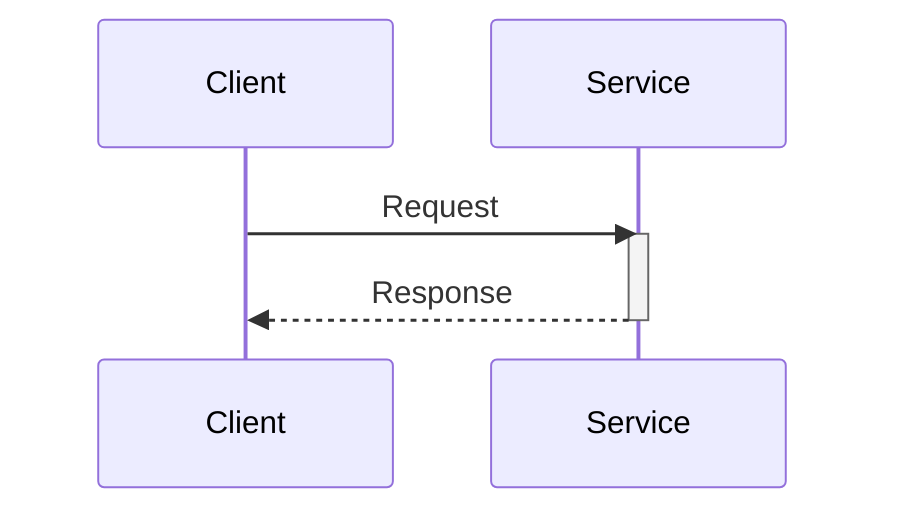

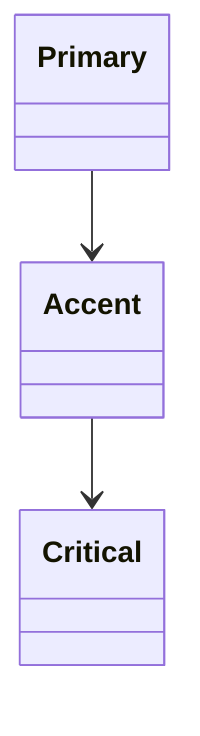

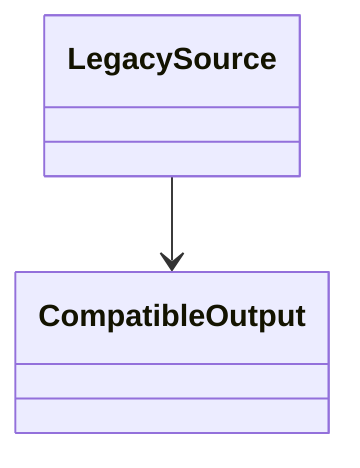

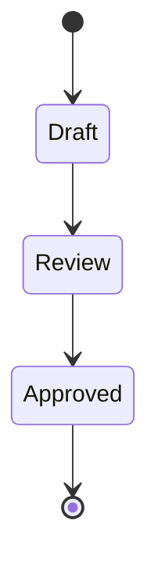

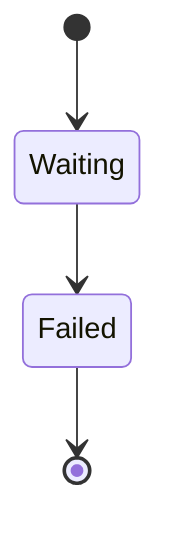

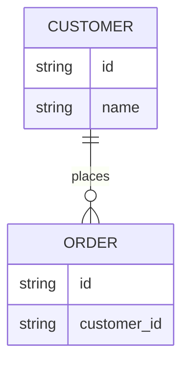

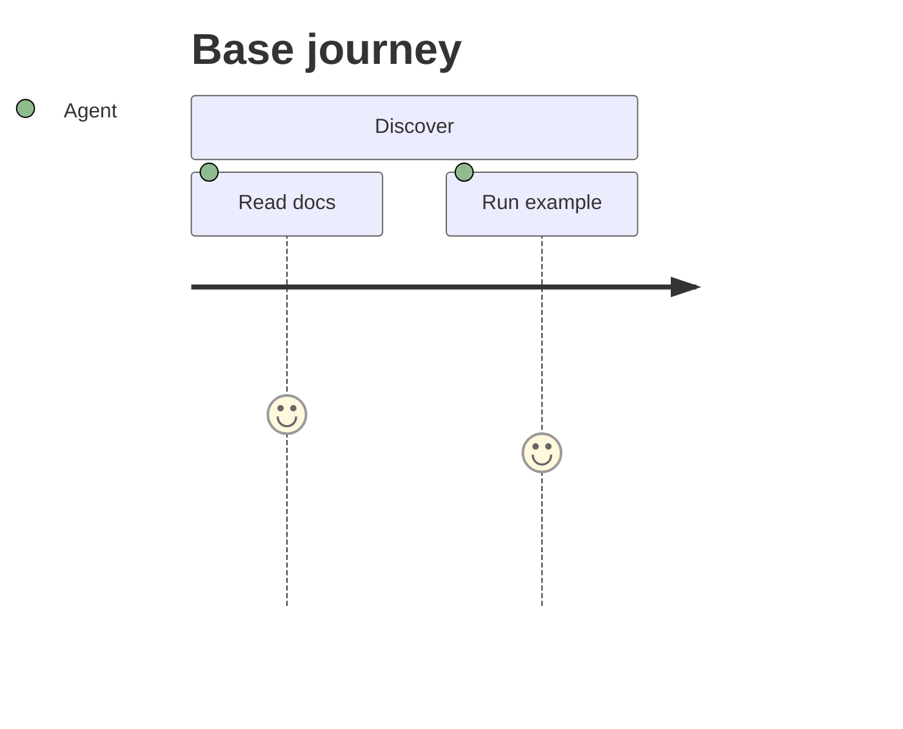

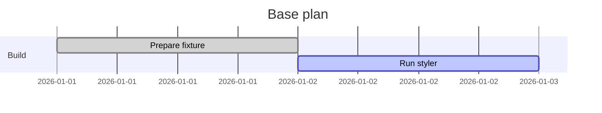

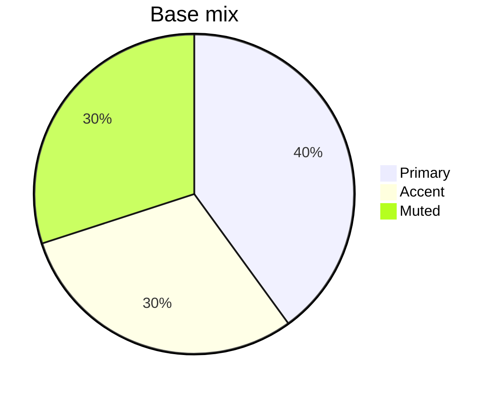

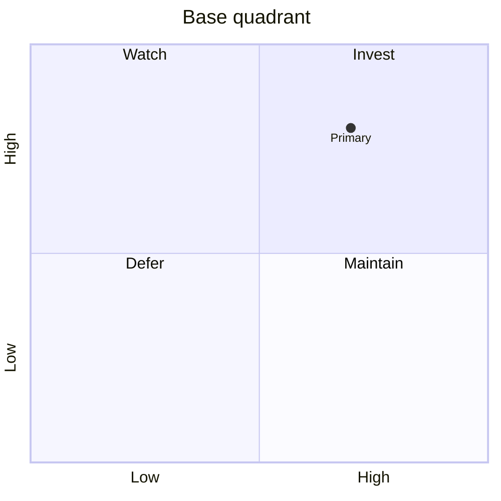

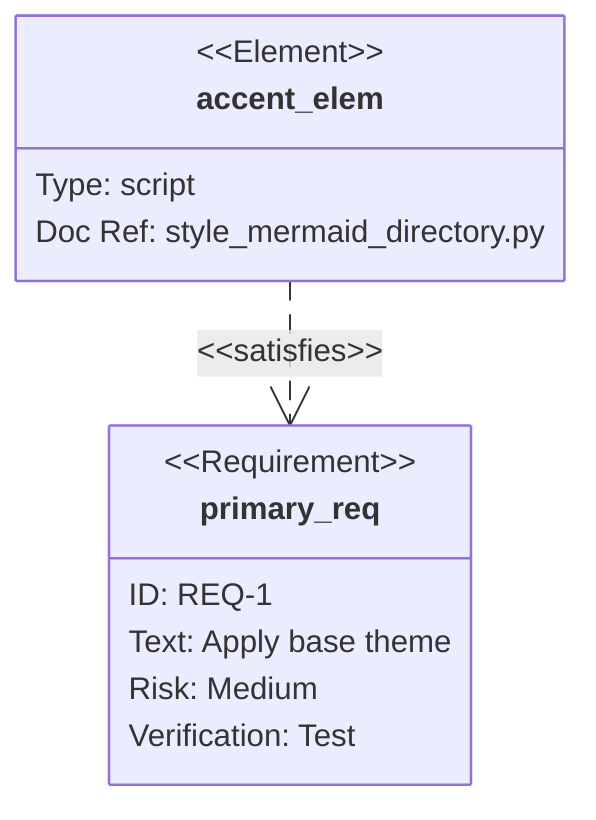

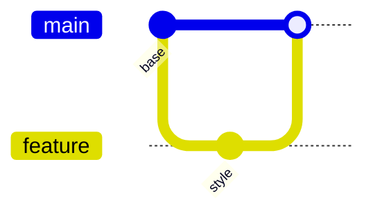

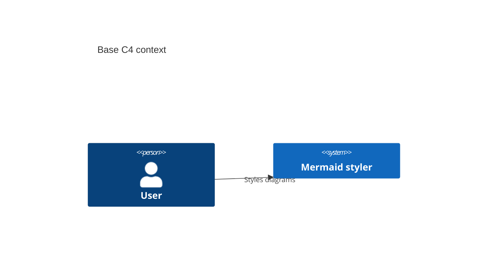

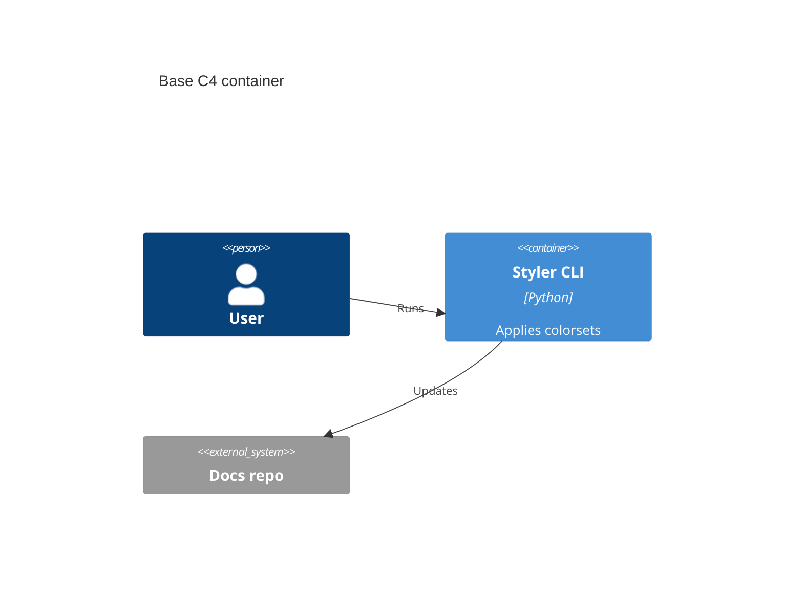

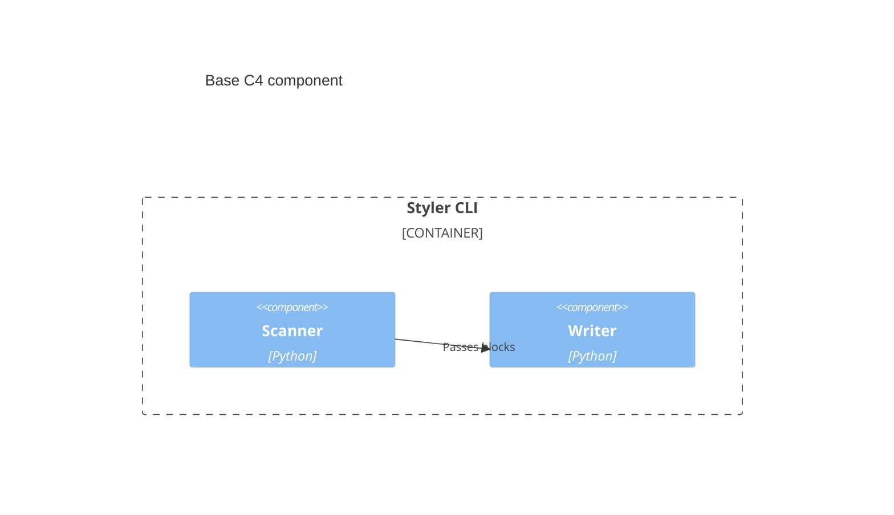

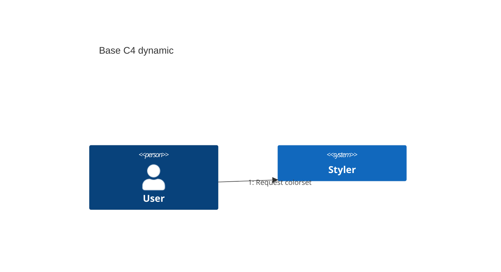

```mermaid
C4Deployment
  title Base C4 deployment
  Deployment_Node(local, "Local workstation") {
    Container(cli, "Styler CLI")
  }
```

```mermaid
mindmap
  root((Base))
    Primary:::csPrimary
    Accent:::csAccent
```

```mermaid
timeline
  title Base lifecycle
  2026-01-01 : Fixture created
  2026-01-02 : Styles applied
```

```mermaid
zenuml
  title Base ZenUML
  @Actor Client
  Service.handle() {
    return result
  }
```

```mermaid
sankey
  Source,Renderer,10
  Renderer,Styled SVG,8
  Renderer,Report,2
```

```mermaid
sankey-beta
  Legacy Source,Renderer,6
  Renderer,Compatible Output,6
```

```mermaid
xychart
  title "Base XY chart"
  x-axis [A, B, C]
  y-axis "Value" 0 --> 10
  bar [2, 5, 8]
  line [1, 4, 7]
```

```mermaid
xychart-beta
  title "Compatible XY chart"
  x-axis [A, B]
  y-axis "Value" 0 --> 5
  bar [2, 4]
```

```mermaid
block
  columns 3
  A["Primary"] B["Accent"] C["Critical"]
  A-->B
  B-->C
  class A csPrimary
```

```mermaid
block-beta
  columns 2
  Legacy["Legacy"] Compatible["Compatible"]
  Legacy-->Compatible
```

```mermaid
packet
  title Base packet
  +4: "Type"
  +4: "Version"
  +8: "Flags"
  +16: "Length"
```

```mermaid
packet-beta
  title Compatible packet
  +8: "Header"
  +24: "Payload"
```

```mermaid
kanban
  backlog[Backlog]
    style[Apply colorset]@{ priority: 'High' }
  done[Done]
    report[Write report]@{ priority: 'Low' }
```

```mermaid
architecture-beta
  group docs(cloud)[Docs]
  service source(disk)[Source] in docs
  service styler(server)[Styler] in docs
  source:R --> L:styler
```

```mermaid
radar-beta
  title Base radar
  axis coverage["Coverage"], classdefs["ClassDefs"], checks["Checks"]
  curve target["Target"]{5, 5, 5}
  curve current["Current"]{4, 5, 5}
  max 5
  min 0
```

```mermaid
eventmodeling
  tf 01 ui SourceDirectory
  tf 02 cmd ApplyColorset
  tf 03 evt MermaidStyled
  tf 04 rmo StyleReport
```

```mermaid
treemap-beta
  "Base"
    "Primary": 10:::csPrimary
    "Accent": 8:::csAccent
    "Critical": 4:::csCritical
```

```mermaid
treemap
  "Compatibility"
    "Legacy": 4
    "Current": 6
```

```mermaid
venn-beta
  title Base overlap
  set A: 10
  set B: 8
  union A, B: 3
```

```mermaid
ishikawa-beta
  Styling drift
    Theme
      Missing base
    Classes
      Undefined semantic class
```

```mermaid
ishikawa
  Compatibility risk
    Declaration
      Legacy alias
    Validation
      Exact manifest gate
```

```mermaid
wardley-beta
  title Base value chain
  anchor Reader [0.90, 0.95]
  component Mermaid-source [0.70, 0.80] (build)
  component Styler [0.45, 0.60] (build)
  Reader -> Mermaid-source
  Mermaid-source -> Styler
```

```mermaid
cynefin-beta
  title Base Cynefin
  complex
    "Unknown renderer support"
  complicated
    "Class syntax audit"
  clear
    "Apply base theme"
  chaotic
    "Broken diagram"
  confusion
    "Unclassified request"
  complex --> complicated : "Pattern found"
```

```mermaid
treeView-beta
"docs/"
  "diagrams/"
    "base.mmd"
    "styled.mmd"
  "reports/"
    "colorset-report.json"
```

```mermaid
railroad-beta
title "Base railroad"
root = choice(
  terminal("identifier"),
  sequence(terminal("("), nonterminal("expression"), terminal(")"))
) ;
```

```mermaid
railroad-ebnf-beta
expression ::= term ("+" term)* ;
term ::= factor ("*" factor)* ;
factor ::= number | "(" expression ")" ;
```

```mermaid
railroad-abnf-beta
title "Base ABNF"
expression = term *( "+" term ) ;
term = factor *( "*" factor ) ;
factor = number / "(" expression ")" ;
number = 1*DIGIT ;
```

```mermaid
railroad-peg-beta
title "Base PEG"
Expression <- Term ("+" Term)* ;
Term <- Factor ("*" Factor)* ;
Factor <- Number / "(" Expression ")" ;
Number <- Digit+ ;
Digit <- "0" / "1" / "2" / "3" / "4" / "5" / "6" / "7" / "8" / "9" ;
```
