# Skill Arena

Skill Arena is a CLI-first benchmark harness for measuring whether skills and
other agent capabilities improve real task performance.

**Main benefit:** replace intuition with reproducible evidence. Every profile
runs against the same prompt, workspace, agent configuration, and constraints,
so the comparison isolates what the added capability actually changed.



## What you can do

- Compare a `no-skill` control against one or more skills or capability bundles.
- Benchmark Codex, Copilot CLI, Pi, OpenCode, Claude Code, and Gemini CLI.
- Repeat every matrix cell and compare pass rate, tokens, latency, and artifacts.
- Materialize isolated workspaces from local, Git, empty, or inline sources.
- Use deterministic assertions or local/hosted LLM judges.
- Evolve a skill from scored candidates or from labeled execution traces.

Skill Arena expands each evaluation into a matrix of
`prompt × agent variant × capability profile`, then writes normalized JSON and
a human-readable comparison report.

## Quick start

Requires Node.js 24+, Git, and at least one authenticated supported agent CLI.

```bash
npm install
npx . val-conf ./evaluations/skill-arena-config-author/evaluation.yaml
npx . evaluate ./evaluations/skill-arena-config-author/evaluation.yaml --dry-run
npx . evaluate ./evaluations/skill-arena-config-author/evaluation.yaml
```

Generate a new evaluation:

```bash
npx . gen-conf \
  --output ./evaluations/my-benchmark/evaluation.yaml \
  --prompt "Complete the benchmark task." \
  --evaluation-type llm-rubric \
  --evaluation-value "Score 1.0 only when every requirement is satisfied." \
  --skill-type local-path \
  --requests 3
```

Credential-dependent benchmarks can allowlist host variables by name without
putting their values in YAML:

```yaml
workspace:
  setup:
    envPassthrough:
      - GITHUB_TOKEN
```

The runtime fails early when an allowlisted variable is missing and keeps its
value out of generated Promptfoo artifacts. See the
[usage guide](./docs/usage.md#pass-credentials-without-storing-secrets).

See the [usage guide](./docs/usage.md) for source shapes, capability profiles,
judges, profile reuse, and result inspection.

## Skill improvement toolkit

The repository includes skills for defining the benchmark, executing it, and
improving another skill through two evidence strategies.



| Skill | Role |
| --- | --- |
| [`skill-arena-config-author`](./skills/skill-arena-config-author/SKILL.md) | Generate, repair, and validate compare configs with explicit controls and alternatives. |
| [`skill-arena-compare-batch`](./skills/skill-arena-compare-batch/SKILL.md) | Use a scripted, benchmark-specific batch path for low-error config authoring. |
| [`skill-arena-run-results`](./skills/skill-arena-run-results/SKILL.md) | Validate, dry-run, execute, and summarize comparisons without dumping raw harness noise. |
| [`skill-arena-evolution`](./skills/skill-arena-evolution/SKILL.md) | Search candidate variants through selection, mutation, and crossover. |
| [`skill-arena-traced-evolution`](./skills/skill-arena-traced-evolution/SKILL.md) | Distill recurring lessons from independent success and failure traces. |

### Evolution strategies

| | Population evolution | Traced evolution |
| --- | --- | --- |
| Use when | Candidate variants can be scored repeatedly under a fixed benchmark. | You have diverse labeled success and failure trajectories. |
| Method | Seed 10 candidates, score all, keep the top 2, then mutate or cross over. | Propose independent trace-local patches, then consolidate by prevalence. |
| Guardrail | Keep the incumbent unless a candidate preserves or improves validated fitness. | Filter scope and conflicts, then validate the consolidated update on holdout traces. |
| Output | One winning skill variant. | One coherent transferable skill update. |

Both strategies keep the benchmark fixed and promote only validated changes.
Population evolution explores alternatives; traced evolution extracts repeated,
generalizable lessons from observed behavior.

## Outputs

Compare runs write to `results/<benchmark-id>/<timestamp>-compare/`:

```text
promptfooconfig.yaml
promptfoo-results.json
summary.json
merged/merged-summary.json
merged/report.md
```

Use `summary.json` for automation and `merged/report.md` for human review.

## Documentation

- [Documentation index](./docs/README.md)
- [CLI reference](./docs/cli-reference.md)
- [Architecture](./docs/architecture.md)
- [Configuration specs](./docs/specs.md)
- [Testing](./docs/testing.md)

Executable examples live under [`evaluations/`](./evaluations/). Generated
Mermaid sources and their static verification renders live under
[`docs/assets/`](./docs/assets/).
