# Architecture

Read this after [README.md](../README.md) and [Usage Guide](./usage.md), or
return to the [documentation index](./README.md). This page explains the runtime
model, execution flow, and source-module boundaries. Use [Specs](./specs.md) for
field-level rules.

Skill Arena evaluates coding agents on repeatable repository tasks under constrained execution settings. It keeps benchmark authoring declarative and pushes agent-specific behavior into adapters.

## System overview

```mermaid
flowchart LR
    Config["Manifest or compare YAML"] --> Load["Load, validate, normalize"]
    Load --> Matrix["Expand scenarios or compare matrix"]
    Matrix --> Workspace["Materialize isolated workspaces"]
    Workspace --> Adapter["Map through agent adapters"]
    Adapter --> Promptfoo["Generate and run Promptfoo config"]
    Promptfoo --> Normalize["Normalize results"]
    Normalize --> Artifacts["summary.json and merged report"]
```

The configuration and declared sources are inputs. Generated workspaces and
results are outputs. Adapter-specific behavior stays between those boundaries
so benchmark schemas do not depend on a particular CLI.

## Runtime module map

| Area | Primary modules | Responsibility |
| --- | --- | --- |
| CLI orchestration | `bin/skill-arena.js`, `src/cli/` | Parse commands and dispatch validation, generation, dry-runs, and live runs. |
| Config contracts | `src/config-file.js`, `src/manifest-schema.js`, `src/compare-schema.js`, `src/manifest.js` | Parse, validate, and normalize authoring formats. |
| Matrix expansion | `src/compare.js`, `src/compare-matrix.js`, `src/compare-reuse.js` | Build compare units and decide whether prior outputs are reusable. |
| Workspace isolation | `src/workspace.js`, `src/runtime-isolation.js`, `src/normalize-workspace.js` | Materialize declared inputs and isolate local CLI state. |
| Adapter boundary | `src/adapters.js`, `src/providers/` | Translate normalized scenarios into local agent executions. |
| Promptfoo integration | `src/promptfoo-config.js`, `src/promptfoo-runner.js`, `src/runner.js`, `src/judge-provider.js` | Build configs, execute Promptfoo, and support local judges. |
| Result normalization | `src/results.js`, `src/normalize*.js`, `src/code-metrics.js` | Produce stable summaries, matrices, reports, and optional code metrics. |

The installed npm package contains only `bin/skill-arena.js`, `src/**/*.js`,
and `README.md`. Documentation, tests, skills, and maintained evaluations are
repository development assets rather than runtime package files.

The installed CLI intentionally exposes only `evaluate`, `gen-conf`, and
`val-conf`. Files under `src/cli/` are internal command implementations, not a
second supported command surface or a set of public npm-script aliases.

## Core components

### Benchmark manifest

The benchmark manifest is the scenario-oriented authoring surface. It defines:

- benchmark identity and description
- the exact task prompt or prompt set
- the declarative workspace sources to materialize
- the optional declarative skill definition
- scenario variants for agent, model, and manifest skill state
- assertions, tracing, concurrency, and request-count settings

### Compare config

The compare config is the matrix-oriented authoring surface. It defines:

- benchmark identity and description
- the exact task prompt or prompt set
- the declarative workspace sources to materialize
- shared evaluation settings plus optional prompt-specific row assertions
- compare variants for adapter and model
- compare profiles such as `no-skill`, `skill-alternative-1`, `skill-alternative-2`, or other explicit capability bundles

The compare runner expands the matrix internally, materializes a separate workspace for each supported variant and profile, and then executes one Promptfoo eval with:

- Promptfoo providers mapped to profile columns
- Promptfoo test rows mapped to variant and prompt pairs

### Workspace sources

Workspace inputs are declared in YAML. Common sources include versioned fixtures in the repository, Git-backed external inputs, and small inline files. Source inputs must be safe to copy and must never be mutated during benchmark execution.

### Workspace materializer

Each scenario run creates a fresh run directory under `results/`. The materializer:

1. creates an empty run workspace
2. applies zero or more `workspace.sources` entries in declaration order
3. injects the skill only when the resolved skill install strategy is `workspace-overlay`
4. initializes a Git repository inside the workspace when requested

This preserves source inputs and gives each eval an isolated workspace.
When `workspace.sources` is omitted or empty, the materializer continues from
the fresh empty directory and still applies capabilities, skills, isolation,
environment settings, and optional Git initialization.

Workspace-injected skills can contain any files needed by the benchmarked agent, including root-level instruction files such as `AGENTS.md` and bundled skill assets such as `skills/<skill-id>/SKILL.md`.

When a scenario enables declared skills, the runtime also adds a small adapter-specific prompt preamble whose only job is to force explicit skill activation before the original benchmark task.

Compare profiles may also materialize non-skill capability bundles such as repository instructions, custom agents, and hooks when the selected adapter supports them. These capability bundles are applied after base workspace sanitization so the profile can intentionally reintroduce files such as `AGENTS.md` or `.github/agents/*`.

For explicit skill declarations, the preferred contract is to declare one benchmarked skill bundle through one of these source modes:

- a local path that points either to one skill directory or to a workspace-overlay bundle root
- inline files that create the entire bundle directly in YAML
- a Git repository plus an optional selected bundle root or selected skill subfolder

Some benchmarks use system-installed skills instead of workspace overlays. In those cases the harness does not inject skill files into the workspace; the benchmark relies on skills already installed in the local agent environment.

Legacy `workspace.fixture`, `workspace.skillOverlay`, and `skillSource` fields are still accepted in V1, but the runtime normalizes them into the declarative workspace and skill model before execution.

### Skill artifact and composition boundaries

An atomic skill is an independently copyable directory. Its `SKILL.md`, bundled
references, scripts, assets, and relative imports stay within that directory,
so installing or testing the skill does not require sibling skills or
repository-root helpers. An atomic skill may still declare a platform
dependency such as the public Skill Arena CLI, another executable, an API, or a
credential. Shared runtime behavior belongs behind those stable interfaces
instead of being duplicated inside each skill.

Some capabilities are intentionally compositions. A workspace-overlay bundle
that combines root instructions with a skill, a profile containing multiple
skills or capability families, and an orchestrator that invokes other skills
must identify that composition and its dependencies. These artifacts can be
isolated and compared like any other profile, but their results describe the
combined capability bundle.

Individual-skill attribution requires a control and a treatment whose only
capability difference is the one atomic skill. Multi-skill or mixed-capability
profiles require additional isolated or factorial cells before the result can
be attributed to one member of the composition.

### Harbor-native evolution boundary

The four Harbor evolution bundles are repository development assets outside the
npm runtime. Each is an independently copyable skill that depends on the
version-pinned Harbor Python package rather than on Skill Arena:

- harbor-population-search
- harbor-trace-distillation
- harbor-reflective-pareto-search
- harbor-operator-coevolution

They materialize one candidate skill per native Harbor job and preserve
Harbor's config.json, lock.json, result.json, per-trial result.json,
trajectories, verifier output, and collected artifacts. Strategy scripts derive
fitness, trace support, case vectors, or parent-to-child operator credit from
those artifacts. They do not import repository runtime modules, invoke the
skill-arena CLI, or translate results into Skill Arena schemas.

Development evidence drives mutation and selection. A separate baseline versus
selected-candidate Harbor job pair supplies the final holdout gate. Task
checksums and resolved job or lock provenance enforce that the holdout did not
enter development and that candidate comparisons changed only skill
provenance.

### Agent adapters

The adapter layer maps a manifest scenario into a Promptfoo provider definition. V1 implements:

- `codex`
- `copilot-cli`
- `pi`
- `opencode`
- `claude-code`
- `antigravity-cli`

### Promptfoo config generator

The generator translates a manifest scenario or compare config into a Promptfoo configuration file. Promptfoo remains the evaluation runtime, but benchmark authors work against repository-native YAML instead of raw Promptfoo YAML.

For Codex, the generated provider is a file-based custom script. The script supports two execution methods:

- `command`: shell out to `codex exec`
- `sdk`: invoke `@openai/codex-sdk`, which still wraps the local Codex CLI

For `copilot-cli`, the generated provider is also a file-based custom script. V1 supports:

- `command`: shell out to the local `copilot` CLI

`copilot-cli` maps sandbox, network, web, and approval settings on a best-effort basis because the Copilot CLI does not expose the same execution controls as Codex.
When compare or manifest profiles declare workspace skills for `copilot-cli`, the runtime mirrors them into `.github/skills/` inside the isolated workspace before execution.

For `claude-code`, the generated provider is also a file-based custom script. V1 supports:

- `command`: shell out to the local `claude` CLI with `-p`

`claude-code` materializes generic benchmark instruction and skill bundles into Claude Code's project-native discovery layout (`CLAUDE.md` and `.claude/skills/*`) inside the isolated execution workspace. Sandbox, network, web, and approval settings are mapped on a best-effort basis through generated Claude settings plus CLI flags.

For `antigravity-cli`, the generated provider is also a file-based custom script. V1 supports:

- `command`: shell out to the local `agy` CLI with `--print`

`antigravity-cli` uses Antigravity's project discovery layout. Generic benchmark
skills are mirrored into `.agents/skills/*`; compare profiles may materialize
custom agents, hooks, MCP configuration, and plugins under `.agents/agents/*`,
`.agents/hooks.json`, `.agents/mcp_config.json`, and `.agents/plugins/*`.
Selecting a profile agent adds the documented `--agent` launch option.

The provider writes `~/.gemini/antigravity-cli/settings.json` under an isolated
home and explicitly maps sandbox, network, web, approval, artifact-review, and
non-workspace access policy. Launch options cover model, agent, mode, log file,
print timeout, project selection or creation, and additional directories. The
sandbox option is always emitted as `--sandbox=true` or `--sandbox=false` so a
host default cannot override the benchmark. Conversation continuation and
interactive prompt flags are rejected because every evaluation request must
start from fresh benchmark state.

For `pi`, the generated provider runs with strict skill isolation by default:

- `--no-skills` disables implicit skill discovery
- when a test enables a workspace-overlay skill, it passes explicit `--skill` paths for those declared skill IDs

For `codex`, skill scope defaults are applied through generated `skills.config` values unless the scenario uses `system-installed` skills.
For skill-enabled scenarios across adapters, Skill Arena also prepends an adapter-specific explicit activation hint before the benchmark task so the runtime can force the declared skill path instead of depending only on implicit matching.

Runtime isolation intentionally seeds only the minimum host state needed for authenticated execution:

- credentials such as `auth.json` may be copied into the isolated home when a local CLI requires them
- host defaults and personalization files such as Codex `config.toml`, Pi `settings.json`, or OpenCode `opencode.json` are not copied
- benchmark profiles therefore compare the same authenticated tool surface without inheriting user-specific default behavior from the host machine
- benchmark-declared `envPassthrough` names are resolved only when a provider
  launches its agent process, so credential values do not enter generated
  Promptfoo configuration artifacts

### Effective runtime isolation

Strict compare-mode isolation targets four inputs only:

- the prompt
- the materialized workspace
- the declared profile capabilities
- the minimum credentials required for local authentication

Credential-dependent tools use explicit name-only allowlists rather than full
host-environment inheritance. Shared names come from
`workspace.setup.envPassthrough`; variant-specific names come from
`agent.envPassthrough`. Missing names fail before agent execution.

Adapter-specific isolation is intentionally uneven because external CLIs do not expose identical control surfaces.

| Adapter | Auth seeded into isolated home | Strict isolation defaults | Residual limitation |
| --- | --- | --- | --- |
| `codex` | `auth.json` plus packaged `.system` skills only | isolated `CODEX_HOME`, generated skill scope config, workspace-only skill injection | runtime behavior still depends on the local Codex CLI implementation |
| `pi` | `auth.json` only | isolated home, `--no-skills`, explicit `--skill` for declared bundles only | no Codex-like first-class sandbox surface |
| `opencode` | `auth.json` only | isolated config dir, generated config content, `--pure`, workspace-only agents and skills | provider semantics still depend on the local OpenCode CLI |
| `claude-code` | no host config by default beyond explicit env/auth passed in | isolated project workspace, `CLAUDE.md` and `.claude/*` mirrored from the workspace, `--setting-sources project` by default | runtime-specific hidden orchestration remains outside Skill Arena control |
| `copilot-cli` | no host config by default beyond explicit env/auth passed in | isolated config dir, `--config-dir`, `--disable-builtin-mcps`, `--disallow-temp-dir`, `--no-auto-update`, `--no-experimental`, `COPILOT_CUSTOM_INSTRUCTIONS_DIRS=` | isolation is partial because the CLI remains more opaque than Codex, Pi, or OpenCode |
| `antigravity-cli` | authentication remains in the operating-system secure keyring; no host settings are copied | isolated home, generated settings and permissions, explicit sandbox state, workspace-native `.agents/*` capabilities | `read-only` cannot prevent every terminal command from writing, and web access cannot be separated perfectly from sandbox network allowlists |

### Result outputs

Each run writes a predictable directory under `results/<benchmark-id>/<timestamp>-<scenario-id>/`:

- `workspace/`
- `promptfooconfig.yaml`
- `promptfoo-results.json`
- `summary.json`

Compare runs write under `results/<benchmark-id>/<timestamp>-compare/` and include:

- `promptfooconfig.yaml`
- `promptfoo-results.json`
- `summary.json` with provider metadata, scenario summaries, and a compare matrix
- `merged/report.md`
- `merged/merged-summary.json`

Provider executions may also write hook artifacts under the materialized workspace at `.skill-arena/hooks/execution-events/`. These JSON files capture the observable command invocation plus any parsed event or tool-call stream emitted by `codex`, `copilot-cli`, `pi`, `opencode`, `claude-code`, or `antigravity-cli`. Antigravity print mode currently contributes command metadata and plain output rather than a structured tool-event stream.

## Execution flow

### Scenario flow

1. Load and validate a benchmark manifest.
2. Select one or more scenarios from the manifest.
3. Materialize a fresh workspace for each scenario.
4. Build the Promptfoo provider config through the adapter registry.
5. Generate a Promptfoo config file for the scenario.
6. Run `promptfoo eval` with the generated config.
7. Export Promptfoo results as JSON.
8. Normalize the results into a stable summary payload.

### Compare flow

1. Load and validate a compare config.
2. Expand compare variants and profiles into internal scenario-like units.
3. Materialize a fresh workspace for each supported unit.
4. Build one Promptfoo config with profile providers and variant/prompt test rows.
5. Run one `promptfoo eval` so Promptfoo shows profiles side by side for each row.
6. Record unsupported adapters as skipped comparison entries and unsupported capability bundles as per-cell unsupported entries.
7. Export Promptfoo results as JSON.
8. Normalize the results into a stable comparison matrix plus a merged report.

For concrete config examples, see [Usage Guide](./usage.md) and the maintained [compare benchmark](../evaluations/skill-arena-config-author/evaluation.yaml).

## Cross-tool capability mapping

Compare profiles are capability-oriented on purpose. Similar names across tools do not imply identical runtime semantics.

- `Native`: first-class documented runtime support
- `Analogous`: similar outcome through a different mechanism
- `IDE-only`: available in an IDE context, not as a comparable runtime primitive
- `No`: not documented as a supported capability
- `Planned`: relevant for future adapter support in Skill Arena

| Capability | Codex | Copilot CLI | OpenCode | Pi | Claude Code | Antigravity CLI |
| --- | --- | --- | --- | --- | --- | --- |
| Project instruction file | Native (`AGENTS.md`) | Native | Native (`AGENTS.md`) | Native (`AGENTS.md`) | Native (`CLAUDE.md`) | Native (`AGENTS.md`, `GEMINI.md`, `.agents/rules`) |
| Skills | Native | Native | Native | Native | Native (`.claude/skills`) | Native (`.agents/skills`) |
| Skill groups / multiple skills | Native | Native | Native | Native | Native | Native |
| Hooks / event hooks | No | Native | Analogous via plugins | Analogous via extensions | Native | Native; no V1 mapping |
| Custom agents | Native | Native | Native | No | Native | No V1 mapping |
| Subagents / delegation | Native | Native | Native | Analogous via extensions/packages | Native | Native; no V1 mapping |
| MCP servers | Native | Native | Native | Analogous via extensions | Native | Native; no V1 mapping |
| Runtime plugin / extension API | No | No | Native plugins | Native extensions/packages | Native plugins | Native plugins; no V1 mapping |
| IDE plugin / IDE extension | No | No | IDE-only | No | Native IDE integration | Native IDE integration |

Notes:

- OpenCode runtime plugins are not the same thing as Claude Code IDE plugins.
- Pi extensions and packages are closer to runtime extensibility than to a benchmark-stable plugin marketplace.
- Copilot CLI hooks are native. OpenCode plugin hooks and Pi extension handlers are analogous, not equivalent.
- Codex should remain `No` for hooks unless OpenAI documents a stable runtime hook surface suitable for deterministic benchmarking.
- `No V1 mapping` means Skill Arena does not currently expose that capability
  for Antigravity CLI; it is not a claim about the product's native surface.

## Design constraints

### Minimal execution context

The harness defaults to:

- small coding models where configured
- `read-only` or tightly scoped sandbox settings
- `approval_policy: never`
- `web_search_enabled: false`
- `network_access_enabled: false`
- no extra system prompt content added by the harness
- execution through the local system Codex runtime instead of a direct hosted Promptfoo provider shortcut

Benchmark integrity depends on strict context boundaries. The runtime should expose only:

- the exact benchmark prompt
- the files materialized into folders explicitly shared with the agent

It should not append hidden harness instructions or rely on knowledge sources outside those declared run inputs.

### Known limitation

Agent providers may still add hidden system instructions, internal orchestration, or tool wrappers. Skill Arena measures the effective agent system, not an impossible "pure model with zero runtime behavior" abstraction.
