# Harbor Evolution Playbook

This is the primary guide for the maintained Harbor-native skill-evolution
surface. It explains when each evolver is appropriate, the strategy each one
implements, how to compose them without leaking holdout evidence, and how to
obtain the strongest reproducible candidate with the fewest unnecessary Harbor
and model calls.

Use Mermaid 11.14.0 or newer to render this guide. Although the current
[Ishikawa syntax page](https://mermaid.js.org/syntax/ishikawa.html) labels the
diagram as 11.12.3+, `ishikawa-beta` was introduced in
[Mermaid 11.13.0](https://github.com/mermaid-js/mermaid/releases/tag/mermaid%4011.13.0),
and 11.14.0 fixed hierarchy preservation. It is still a beta grammar, so
validate these blocks again when upgrading Mermaid. The lifecycle diagrams use
the stable `stateDiagram-v2` grammar.

## Choose one primary evolution strategy

Choose from the evidence that can justify the next edit, not from whichever
strategy produces the highest score after trying all of them.


| Skill | Best when | Core strategy | Do not start here when |
| --- | --- | --- | --- |
| [`harbor-population-search`](../skills/harbor-population-search/SKILL.md) | One stable scalar objective can evaluate the baseline and several genuine alternatives. | Hard-gated scalar ranking, top-two survival, then focused mutation or crossover. | There is only one child, important cases conflict, or an average can hide regressions. |
| [`harbor-trace-distillation`](../skills/harbor-trace-distillation/SKILL.md) | Diverse completed traces contain recurring, independently supported lessons. | Evidence-cited diagnoses, minimum support across trials and task checksums, conflict resolution, and patch consolidation. | Evidence is thin, correlated, external-only, or cannot establish a safe causal edit. |
| [`harbor-reflective-pareto-search`](../skills/harbor-reflective-pareto-search/SKILL.md) | Case outcomes conflict and weak cases have verified local feedback. | Hard-gated case vectors, a non-dominated archive, reflection on weak cases, and lineage-bound children. | Only an aggregate reward exists or full case-vector reevaluation is unaffordable. |
| [`harbor-operator-coevolution`](../skills/harbor-operator-coevolution/SKILL.md) | Repeated generations provide unambiguous parent-child-operator lineage and several established operators. | Parent-to-child operator credit, establishment gates, and breeding of mutation instructions. | This is a first generation, fewer than two operators are established, or attribution is noisy. |
| [`harbor-evolve-skill`](../skills/harbor-evolve-skill/SKILL.md) | One integrated optimizer should author complete `SKILL.md` revisions from train feedback and select on validation. | GEPA reflective Pareto optimization over text candidates, followed by independent holdout. | Scripts, references, or assets must change, or deterministic patch-level control is required. |

Every row requires a frozen baseline and execution profile, development-only
selection evidence, and an untouched baseline-versus-candidate holdout. If no
row's evidence contract is satisfied, use `harbor-run-results` to inspect the
jobs and improve the benchmark, diagnostics, or candidate breadth before
evolving anything.

## Separate the three responsibilities

Do not treat every Harbor skill as an optimizer. Use one execution/reporting
surface, an optional recovery layer, and one primary evolution mechanism per
declared development stage.

| Responsibility | Skill | Use it for | Efficiency rule |
| --- | --- | --- | --- |
| Execute or report native Harbor jobs | [`harbor-run-results`](../skills/harbor-run-results/SKILL.md) | Harbor-only inspection, comparison, and final reports | Inspect existing evidence before requesting a fresh run. |
| Recover unavailable cells | [`harbor-resume-external-failures`](../skills/harbor-resume-external-failures/SKILL.md) | Verified external failures only | Reuse successful and semantic outcomes; accept the first evaluable retry. |
| Evolve | [`harbor-population-search`](../skills/harbor-population-search/SKILL.md), [`harbor-trace-distillation`](../skills/harbor-trace-distillation/SKILL.md), [`harbor-reflective-pareto-search`](../skills/harbor-reflective-pareto-search/SKILL.md), [`harbor-operator-coevolution`](../skills/harbor-operator-coevolution/SKILL.md), or [`harbor-evolve-skill`](../skills/harbor-evolve-skill/SKILL.md) | Candidate generation, selection, or both | Choose the least complex mechanism whose evidence contract is satisfied. |

Every evolution path must freeze the baseline, development and holdout task
sets, reward and hard-gate policy, agent, model, attempts, retry policy,
environment, and timeout profile before the first scored candidate. Keep
Harbor's built-in retry count at zero. A later selective recovery is a separate
evidence-producing operation, not an invisible retry inside the benchmark.

## The minimum-call operating sequence

1. **Freeze and fingerprint the contract.** Preserve the incoming skill,
   canonical skill name and digest, task checksums, execution profile, reward
   key, non-compensating required rewards, and promotion policy.
2. **Validate without calls.** Run the selected skill with `--dry-run`, then
   `--doctor`. Fix schema, paths, credentials, Docker, and identity before live
   execution.
3. **Reuse native evidence.** Prefer `--analyze-only`, `--skip-run`, or the
   reporting-only path when canonical completed Harbor jobs already exist.
4. **Repair availability, not quality.** If only some cells are unavailable,
   run `harbor-resume-external-failures`. It may retry a cell only when
   structured or allowlisted evidence proves an external failure. A semantic
   failure, failed reward gate, context limit, agent timeout, or ambiguous
   failure receives no retry.
5. **Choose one mechanism for each development stage.** Use the quadrant and
   decision table below. Do not run all strategies merely to see which returns
   the best score.
6. **Spend development calls once per declared cell.** Generate edits from
   bounded development evidence, keep the baseline unchanged, and preserve all
   rejected candidates and costs.
7. **Open holdout once.** Evaluate only the unchanged baseline and the single
   frozen development selection. Skip holdout when the selected digest equals
   the baseline or no candidate passes development gates.
8. **Promote or retain.** Promote only after the holdout policy and ordinary
   skill tests pass. Otherwise retain the baseline and use the recorded
   failure mechanism to decide the next generation.

| Mode or phase | Harbor/model calls | Appropriate use |
| --- | ---: | --- |
| `--dry-run` | 0 | Validate the declared plan and resolved inputs. |
| `--doctor` | 0 | Validate credentials by name, paths, Docker, and environment readiness. |
| `--analyze-only` or `--skip-run` | 0 | Reuse complete, provenance-valid jobs. |
| Development | One per declared candidate-task-attempt cell | Produce optimizer-visible evidence. |
| Selective external recovery | Only eligible unavailable cells | Restore comparability without rerunning valid or semantic outcomes. |
| Holdout | Baseline and one selected candidate only | Make the release decision after selection is frozen. |

## Recommended compositions

- **Fast scalar path:** population search with the unchanged baseline plus
  several focused children, followed by one baseline-versus-winner holdout.
- **Rich-evidence default:** trace distillation produces supported patches;
  freeze those candidates, then use reflective Pareto search to retain
  complementary strengths and select one holdout entrant.
- **Integrated automated path:** `harbor-evolve-skill` lets GEPA propose SKILL.md
  candidates from training feedback and select with optimizer-visible
  validation before the independent holdout.
- **Mature plateau path:** after several ordinary generations, use operator
  coevolution to learn which mutation instructions reliably improve their own
  evaluated parents.
- **Partial-outage path:** place selective external recovery between Harbor
  execution and strategy analysis. Feed only a complete `effective-job` into
  an evolver's normal `--analyze-only` interface.

Never chain methods by letting a later method inspect the final holdout of an
earlier method. When composing methods, all candidate generation and selection
must remain inside one development boundary; the release holdout is opened
only after the final candidate digest is frozen.

## GEPA versus reflective Pareto search

Both preserve complementary case strengths, but they own different parts of
the editing loop.

| Choose `harbor-evolve-skill` | Choose `harbor-reflective-pareto-search` |
| --- | --- |
| GEPA should author complete `SKILL.md` text proposals automatically. | An editing agent should author explicit, evidence-cited candidate changes. |
| Training feedback drives reflection and validation chooses among candidates. | Identical development case vectors construct an inspectable non-dominated archive. |
| Metric-call and proposal budgets are the main search controls. | Generation, parent lineage, archive membership, and case-level weaknesses are the main controls. |
| Only `SKILL.md` should change; bundled scripts, references, and assets remain fixed. | Candidate bundles or merge hypotheses need explicit review and lineage outside GEPA's text-only contract. |
| The optimizer's proposal loop is preferred over manual patch orchestration. | Deterministic archive artifacts and deliberate per-case edits are more important than integrated automation. |

## Population search

Use population search for a trusted scalar objective when the budget supports
the baseline plus several genuine alternatives. It is the cheapest mechanism
to understand and parallelize, but one child is a comparison, not a useful
population.

| Decision | Population-search rule |
| --- | --- |
| Optimizes | Absolute hard-gated scalar fitness across a real candidate population. |
| Selects | The highest qualified candidate; preserves the top two evaluable survivors for another generation. |
| Learns | Which focused mutation or crossover hypotheses improve the frozen objective. |
| Stops | On a promoted holdout winner, a no-op winner, no qualified candidate, budget exhaustion, or plateau. |

Efficient steps:

1. Freeze a development template and a separate holdout template.
2. Keep the original baseline and create several children, each with one
   explicit hypothesis.
3. Run `--dry-run` and `--doctor`; use `--analyze-only` for completed canonical
   jobs.
4. Rank by hard-gated fitness, preserve the top two evaluable survivors, and
   retain complementary repair parents only as next-generation evidence.
5. Skip holdout for a no-op digest or an unqualified winner. Otherwise compare
   the baseline with the selected winner and reject task regressions by
   default.

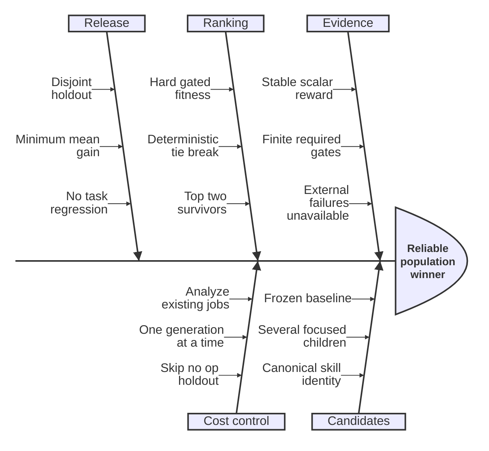

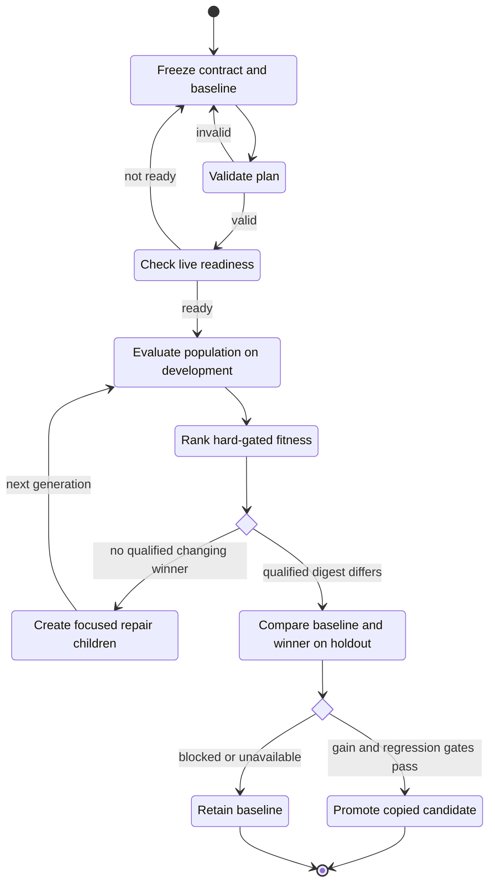

## Trace distillation

Use trace distillation when completed Harbor artifacts already contain a
diverse pattern of success and failure. It saves calls because candidate
construction can happen from the existing discovery pool; unsupported edits
are rejected before holdout.

| Decision | Trace-distillation rule |
| --- | --- |
| Optimizes | Patch support and transferability, not the reward of one memorable trial. |
| Selects | Only non-conflicting patches supported by at least two unique trials and two unique task checksums. |
| Learns | Recurrent mechanisms from bounded trajectories, outputs, logs, and verifier evidence. |
| Stops | With an unchanged candidate when causal support is insufficient, or after one frozen candidate reaches holdout. |

Efficient steps:

1. Freeze discovery and holdout as disjoint task-name and checksum sets.
2. Import completed discovery jobs and run `--analyze-only` before authoring a
   proposal. This normalizes evidence without executing jobs or reading
   holdout.
3. Diagnose from bounded trajectory, output, log, or verifier evidence. Every
   accepted patch needs at least two unique trials and two unique task
   checksums.
4. Resolve conflicting proposals, materialize only supported changes, and keep
   the candidate unchanged when the causal evidence is insufficient.
5. Run one baseline-versus-candidate holdout after the proposal is frozen.

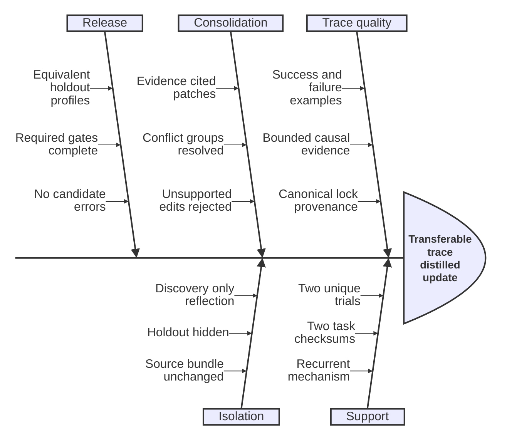

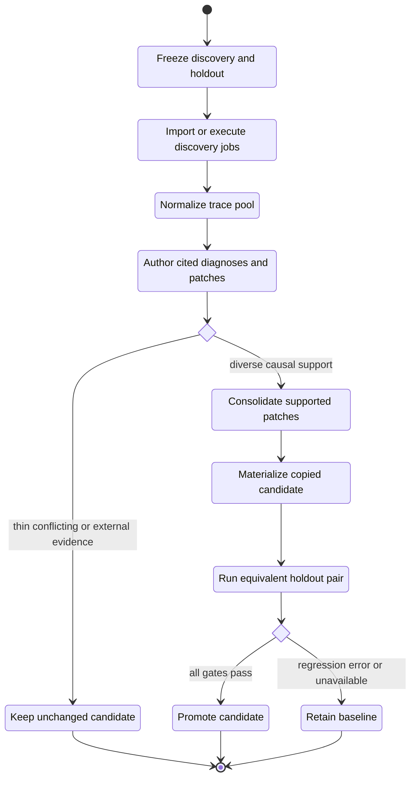

## Reflective Pareto search

Use reflective Pareto search when task families conflict and an average would
hide complementary strengths. Its extra full-case reevaluation cost is
justified only when each weak case has bounded, verified evidence that can
guide a safe edit.

| Decision | Reflective-Pareto rule |
| --- | --- |
| Optimizes | A vector of hard-gated case outcomes instead of one compensating mean. |
| Selects | Non-dominated candidates; ties favor fewer errors and the smaller bundle. |
| Learns | Case-local edits from verified weak-case evidence while preserving passing behavior. |
| Stops | When one robust archive member qualifies, the archive plateaus, or full-case reevaluation is no longer affordable. |

Efficient steps:

1. Evaluate each candidate on the identical development case set and build its
   hard-gated case vector.
2. Exclude candidates with external unavailable cells, execution errors, or
   required-reward failures from the archive while retaining their diagnostics.
3. Preserve non-dominated candidates, reflect on their weakest cases, and
   create children with explicit parents and rationales.
4. Stop when a robust candidate exists or the archive plateaus; do not expand
   the archive without a new complementary strength.
5. Freeze one archive member and run the separate holdout phase.

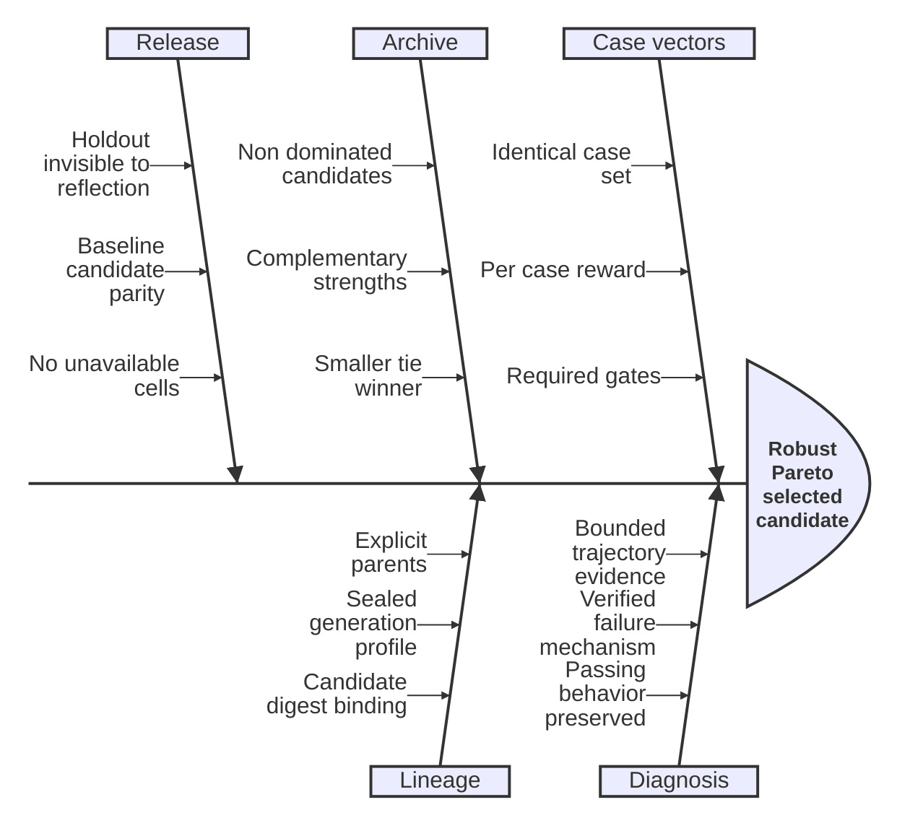

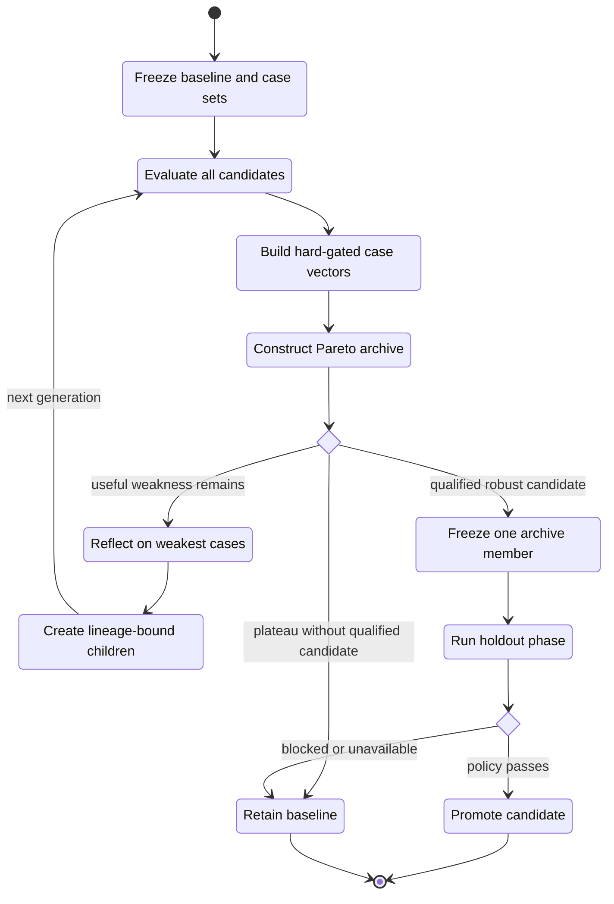

## Operator coevolution

Use operator coevolution only after ordinary candidate mutations have been
observed across repeated generations. It learns which mutation instructions
produce improvements relative to their own evaluated parents; it is not a
shortcut for a first generation.

| Decision | Operator-coevolution rule |
| --- | --- |
| Optimizes | Candidate fitness and the mutation operators' parent-relative improvement credit. |
| Selects | Qualified candidate survivors plus operators established by enough independent, attributable trials. |
| Learns | Which mutation instructions repeatedly create non-regressing children from their own parents. |
| Stops | When a candidate promotes, operator credit plateaus, lineage is insufficient, or the next generation cannot be sealed. |

Efficient steps:

1. Freeze at least two operators, at least two candidates, and one evaluated
   parent plus one unambiguous operator for every generated child.
2. Rank candidates by absolute hard-gated fitness, then compute operator credit
   from parent-to-child improvement. Do not credit regressions or unavailable
   fitness.
3. Require the configured minimum independent operator trials. Under-sampled
   operators remain diagnostic and cannot breed.
4. Breed only established survivors, realize the plan as attributable child
   bundles, and bind the next generation to the immediate sealed predecessor.
5. Open holdout only for a qualified candidate after development selection.
   Complementary repair is diagnostic-only and never a promotion path.

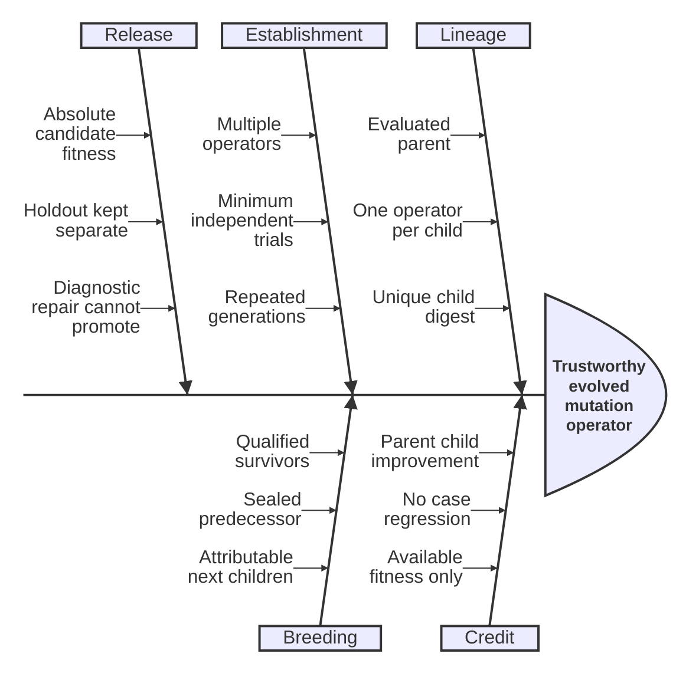

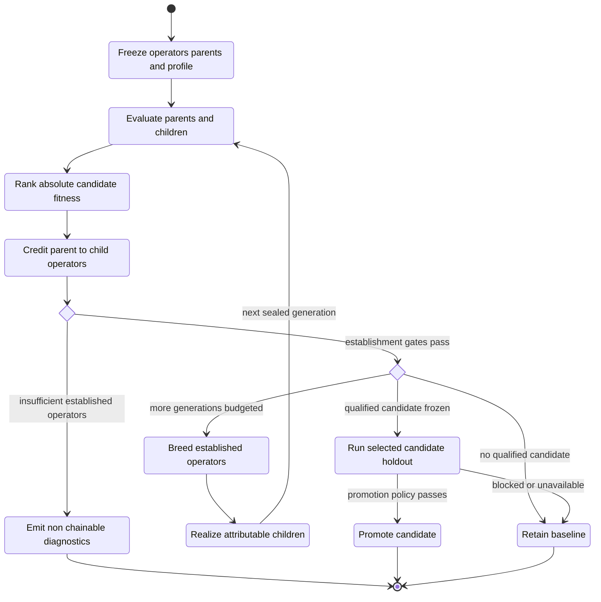

## Integrated GEPA evolution

Use `harbor-evolve-skill` when one integrated optimizer should generate and
select complete SKILL.md revisions. GEPA receives bounded Harbor development
feedback, proposes text, preserves Pareto-useful candidates, and uses
validation for optimizer-visible selection. Holdout remains independent.

| Decision | Integrated-GEPA rule |
| --- | --- |
| Optimizes | Complete `SKILL.md` text with GEPA over training feedback and validation cases. |
| Selects | A validation winner from Pareto-useful candidates; validation is not the release claim. |
| Learns | Reflective text revisions from rewards, bounded diagnostics, errors, outputs, and trajectories. |
| Stops | At the declared metric-call or proposal budget, convergence, an unsafe/no-op candidate, or the final holdout decision. |

Efficient steps:

1. Freeze three disjoint splits: training, validation, and holdout.
2. Set explicit metric-call and candidate-proposal budgets, disable evaluation
   caching during search, and run `--dry-run` plus `--doctor`.
3. Let training evidence drive reflection and validation select among proposed
   SKILL.md files. Keep errors visible and abort on external infrastructure or
   compatibility failures rather than scoring them as candidate quality.
4. Inspect the selected candidate for leakage, unnecessary complexity, stale
   links, and inconsistency with unchanged bundle resources.
5. Compare the baseline and selected candidate on holdout, preferably with at
   least two attempts per task when variance matters.

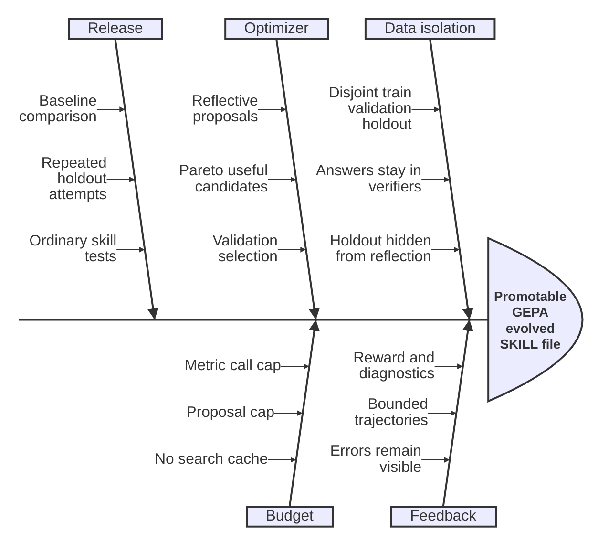

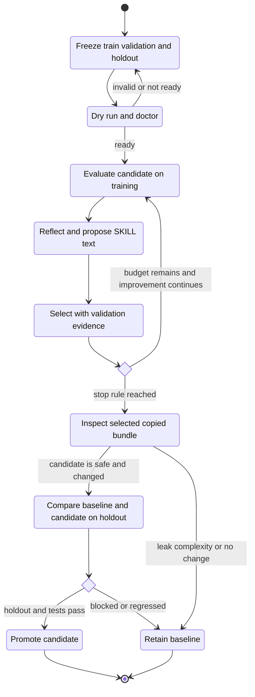

## Selective external-failure recovery

`harbor-resume-external-failures` is not an optimizer. It is the call-saving
adapter that makes a partially unavailable evaluation consumable by an
optimizer without granting extra attempts to semantic failures.

Efficient steps:

1. Classify every source trial from verifier-owned structured diagnostics or
   exact allowlisted exception types and codes. Missing reward or free-form
   error text is never sufficient.
2. Deny semantic failures, required-gate failures, context limits, timeouts,
   token or tool budgets, ambiguous signals, and provenance drift.
3. Run `--doctor` and `--dry-run`; inspect the eligible and excluded counts.
4. For each eligible external cell, seal a cap-consuming reservation before
   one fresh immutable Harbor attempt. Authentication and environment failures
   also require digest-bound remediation evidence and a live preflight.
5. Select the first evaluable retry in attempt order, never the best score. If
   every source trial now has an effective result, publish the verified
   `effective-job` atomically and pass it to the evolver with `--analyze-only`.

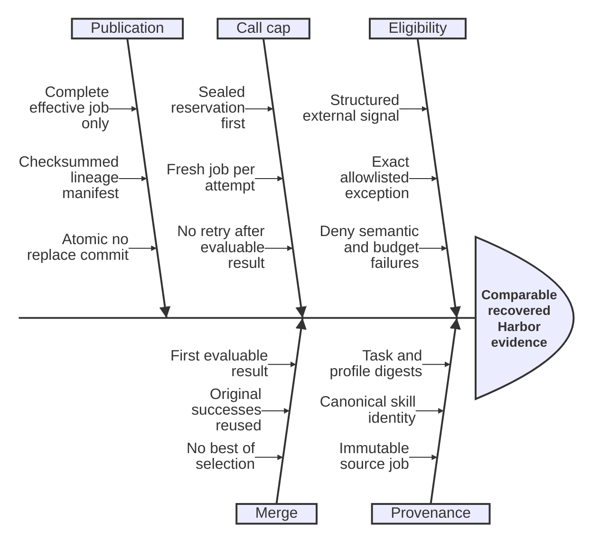

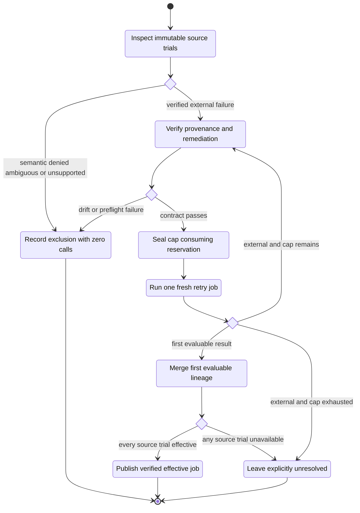

An exact completed-agent, pre-verifier Harbor infrastructure failure has a
separate versioned verifier-only recovery contract. Use it only when every
sealed predicate matches. It adds no Harbor, agent, or model call and must not
be generalized from an exception message.

## Stop and promotion rules

Stop the current search when any of these conditions holds:

- a frozen candidate passes the untouched holdout and ordinary bundle tests;
- the selected candidate digest equals the baseline;
- no candidate is evaluable or qualified after external availability is
  resolved;
- the configured proposal, metric-call, candidate, or generation budget is
  exhausted;
- the archive, trace consolidation, scalar ranking, or operator credit has
  plateaued without a new supported hypothesis;
- provenance, task isolation, or evaluation-profile parity cannot be proven.

A report may call a result `promote` only when the selected development
candidate is canonical and qualified, the baseline and candidate holdout jobs
are complete and comparable, all required rewards are available, the minimum
gain policy passes, and the copied candidate passes its normal validation and
tests. Everything else is staged, exploratory, diagnostic, not evaluable, or
baseline retained.

## Command map

Run each command from the independently copied skill bundle and read its linked
reference contract before authoring a live configuration.

| Skill | Main executable | Zero-call preparation | Completed-job reuse |
| --- | --- | --- | --- |
| `harbor-population-search` | `scripts/search_harbor_population.py` | `--dry-run`, `--doctor` | `--analyze-only` with one exact job mapping per candidate |
| `harbor-trace-distillation` | `scripts/distill_harbor_traces.py <config.yaml>` | `--dry-run`, `--doctor` | `--analyze-only` imports discovery and evaluates proposal state |
| `harbor-reflective-pareto-search` | `scripts/harbor_reflective_pareto.py <config.yaml>` | `--dry-run`, `--doctor` | `--analyze-only`; use `--phase holdout` only after selection |
| `harbor-operator-coevolution` | `scripts/harbor_operator_coevolution.py <generation.yaml>` | `--dry-run`, `--doctor` | `--analyze-only`; `--phase development` keeps holdout unopened |
| `harbor-evolve-skill` | `scripts/evolve_skill_with_harbor.py <evolution.yaml>` | `--dry-run`, `--doctor` | No artifact-only optimizer mode; use a new output directory per run |
| `harbor-resume-external-failures` | `scripts/resume_external_failures.py <config.yaml>` | `--dry-run`, `--doctor` | `--analyze-only` only for sealed recovery input and effective-job materialization |

For results-only work, use `harbor-run-results` rather than invoking an
optimizer. The former `harbor-runner` Skill Arena reporting bridge is
deprecated and retained only for legacy reproduction and migration.
