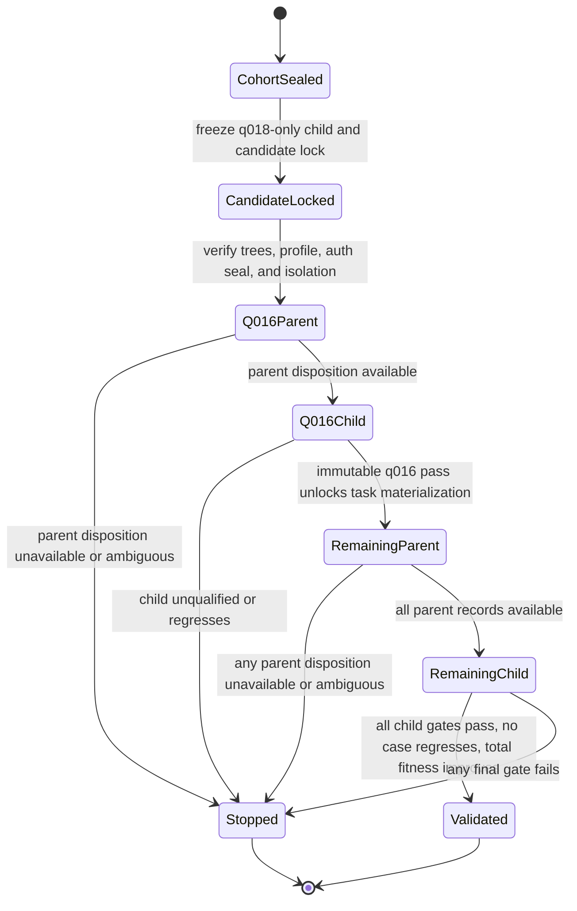

# Generation 005 q018-only reflection validation

Generation 005 is a prospective development test for a child evolved from one
source of benchmark feedback: the sanitized q018 diagnosis. It compares that
child with its frozen `extractive-one-shot-answer` parent. It does not treat
q018 as validation, and it excludes q024 and q030 because both were already
observed in generation 004.

The machine-readable contract is [`protocol.json`](protocol.json). The cohort,
task-tree digests, Harbor profile, diagnostic policy, gates, and call ceiling
were sealed while the child identity was intentionally unknown. The protocol
must not be edited later to insert the child. A separate, exclusive-create
`candidate-lock.json` must bind the finished child to this protocol before any
selected task is opened or materialized.

Candidate-specific implementation notes are kept separately in
[`distillation/README.md`](distillation/README.md).

## Content-blind selection

Selection inspected only immediate discovery-directory basenames. It did not
inspect task instructions, qrels, rubric points, verifier material, prior
answers, trajectories, or outputs. Tree checks read file bytes only to compute
opaque digests, counts, and byte totals.

The rule is deterministic:

1. List immediate child directory names matching `^q\d{3}$` under the discovery
   root and sort them by ordinal UTF-8 byte order.
2. Remove q003, q007, q018, q024, and q030. Exclude the holdout and hard roots
   completely.
3. For every remaining ID, compute SHA-256 over the UTF-8 bytes of
   `knowledge-consult-harbor-g005|fresh-discovery-v1|<task-id>`.
4. Sort by lowercase hexadecimal digest, then task ID, and take the first four.
5. Use rank 1 as a cheap first gate and ranks 2 through 4 as the remaining
   validation batch.

That rule selected:

| Stage | Task | Tree SHA-256 | Files | Bytes |
| --- | --- | --- | ---: | ---: |
| First gate | q016 | `c461e33b9814912fa3c9fbb6e3d5f187de2de2931ad54e54ded377c9da4a006d` | 12 | 3,757,565 |
| Remaining | q022 | `aafe5911be4bee50823256013c50f5bec2c9f5a3c6fd653e2506053311e36cd5` | 12 | 3,755,408 |
| Remaining | q019 | `9e9ec790f1ea0e15b974c0468d98cdad4d3ea78489f35b4512b89e4995ebd2e3` | 12 | 3,755,413 |
| Remaining | q001 | `b4604f6c4734816bb35e51ea7d4f9133045e915a964a54727b4577a78a26ab5a` | 12 | 3,760,512 |

The protocol records all 19 eligible IDs, every ranking key, and digests of
both the eligible and ranked inventories. This makes the selection auditable
without revealing case content and leaves 15 eligible discovery cases unused.

## Candidate freeze boundary

The child may use the frozen parent bundle plus one sanitized, digest-bound
q018 feedback artifact. It may not use q024 or q030, the selected generation-005
tasks, any other discovery task content, or any holdout/hard material. Its lock
must bind:

- this protocol file's SHA-256;
- child ID, canonical skill name, source path, tree digest, file count, and
  total bytes;
- the exact parent ID and tree digest;
- the q018 feedback receipt and mutation procedure by path and digest;
- an exact `feedbackTaskIds: ["q018"]` declaration and contamination
  attestations.

The child tree and lock are immutable after that point. Seeing public task IDs
does not release their instructions; the selected directories remain outside
the candidate-author workspace.

## Staged test state

The fully successful path uses at most four Harbor invocations and eight model
executions: parent then child on q016, followed by one three-task parent job and
one three-task child job. Harbor retries, automatic retries, selective external
resume attempts, and best-of selection are all zero. An unavailable external
or ambiguous result stops the stage.

The exact candidate-attributable context-limit tuple remains measurable as an
available operational zero but never qualifies and never authorizes a retry.
The child must pass all three configured reward gates on every selected task.
Final validation additionally requires no per-task regression and a strictly
positive total effective-fitness gain across all four tasks. Token use and
latency may be reported but do not compensate for a failed quality gate.

## Execution remains fail-closed

This commit intentionally adds no runtime materialization and launches no
Harbor or model calls. The protocol alone does not authorize execution. Before
a live run, generation 005 still needs model-free, tested tooling for exclusive
candidate-lock creation and validation, staged task preparation, exact profile
verification, a fresh private Pi authentication seal, parent-before-child call
gating, and sanitized publication.

Holdout and hard release are outside this protocol. A passing result is
prospective development evidence, not final promotion evidence.
